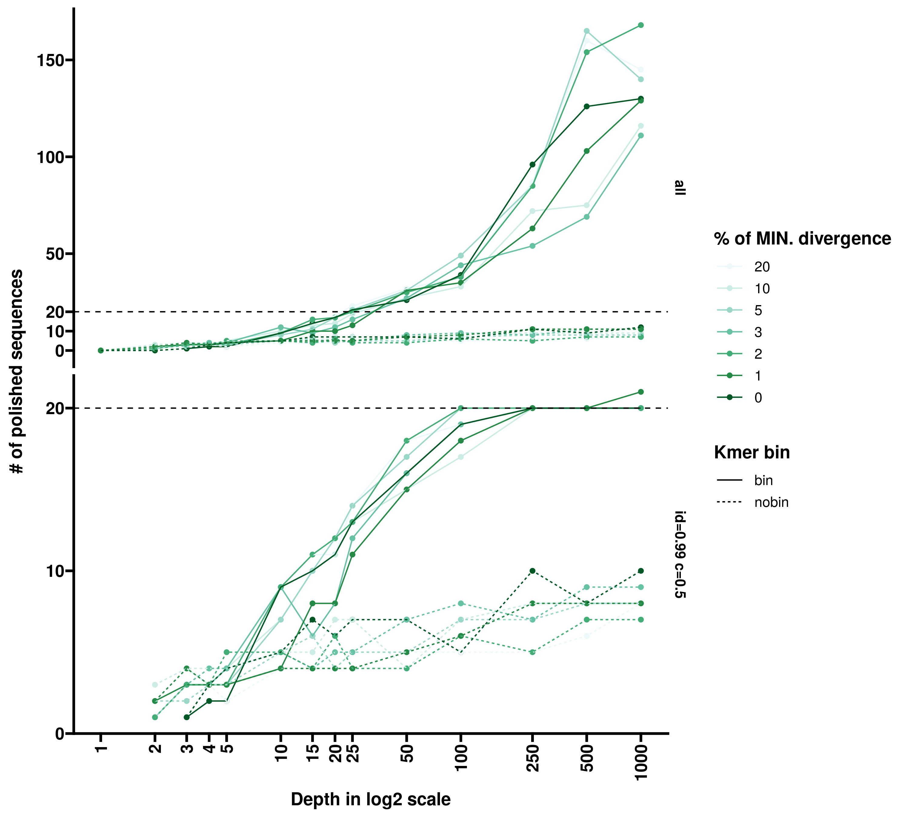
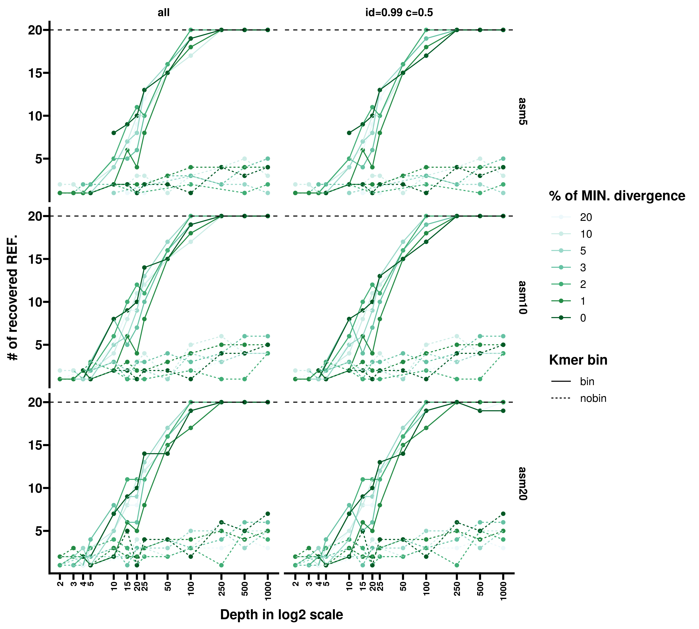
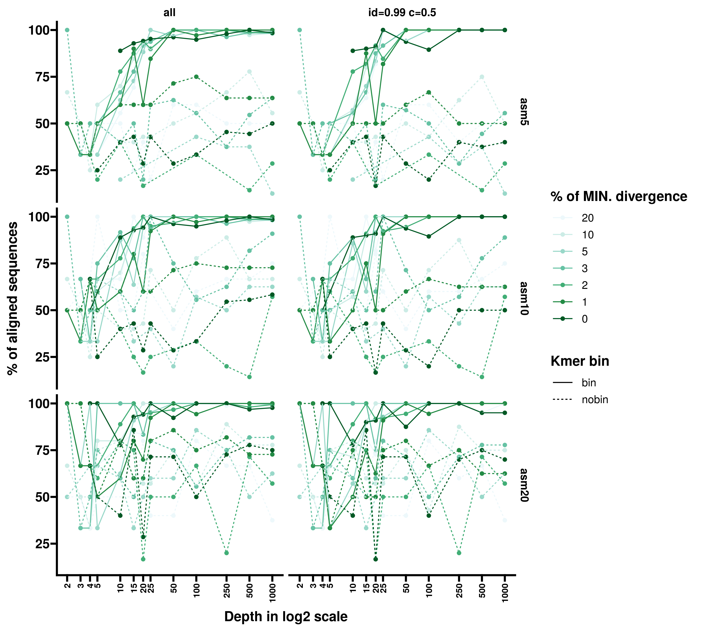
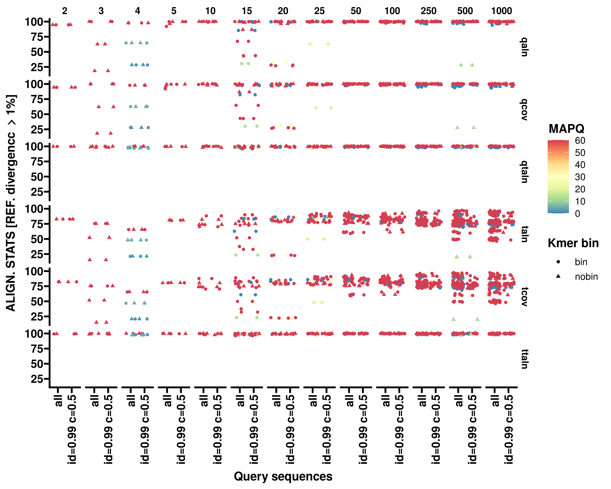
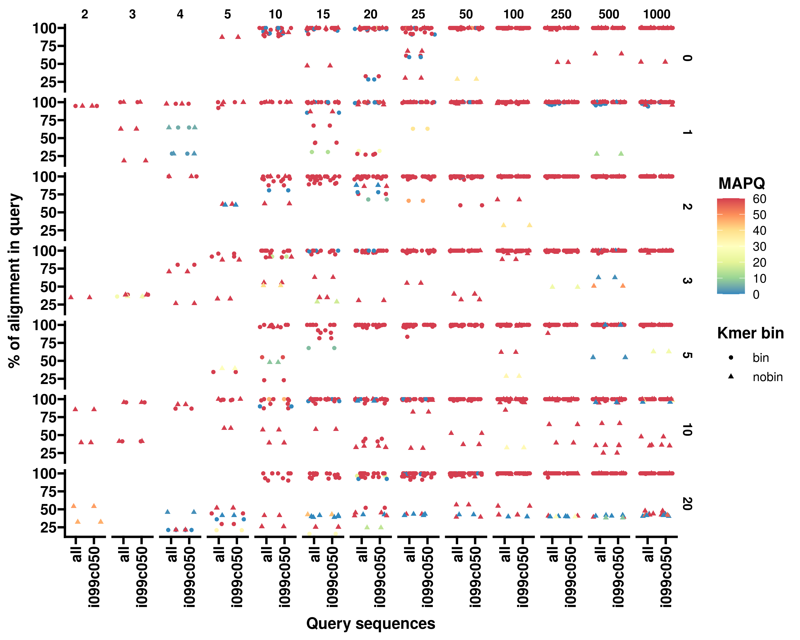
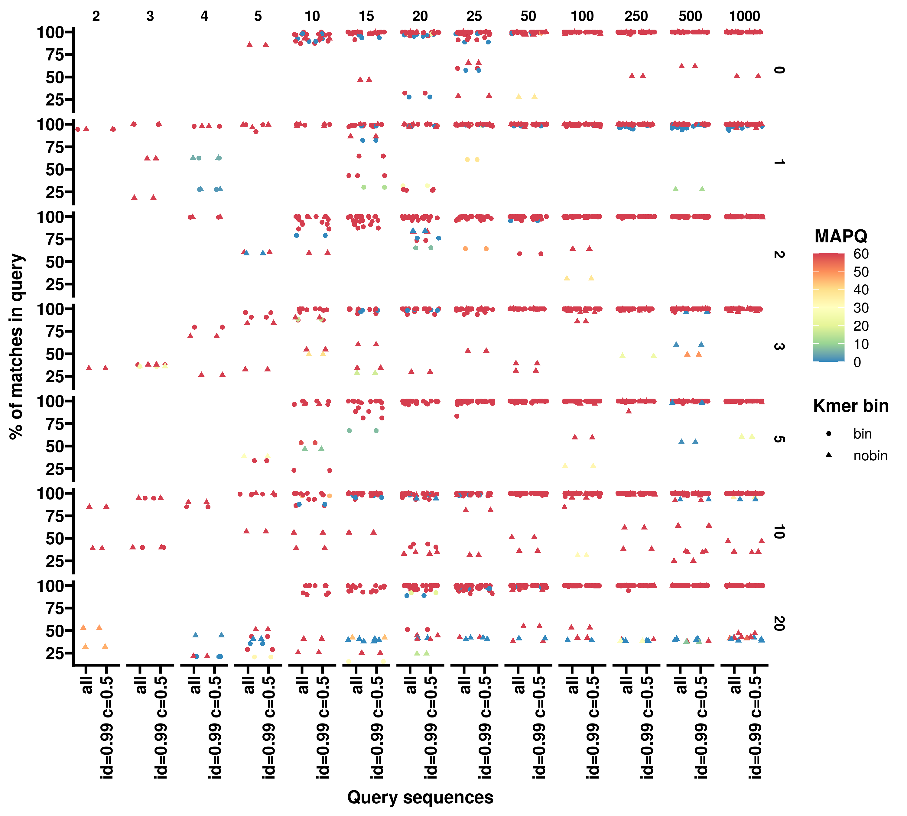
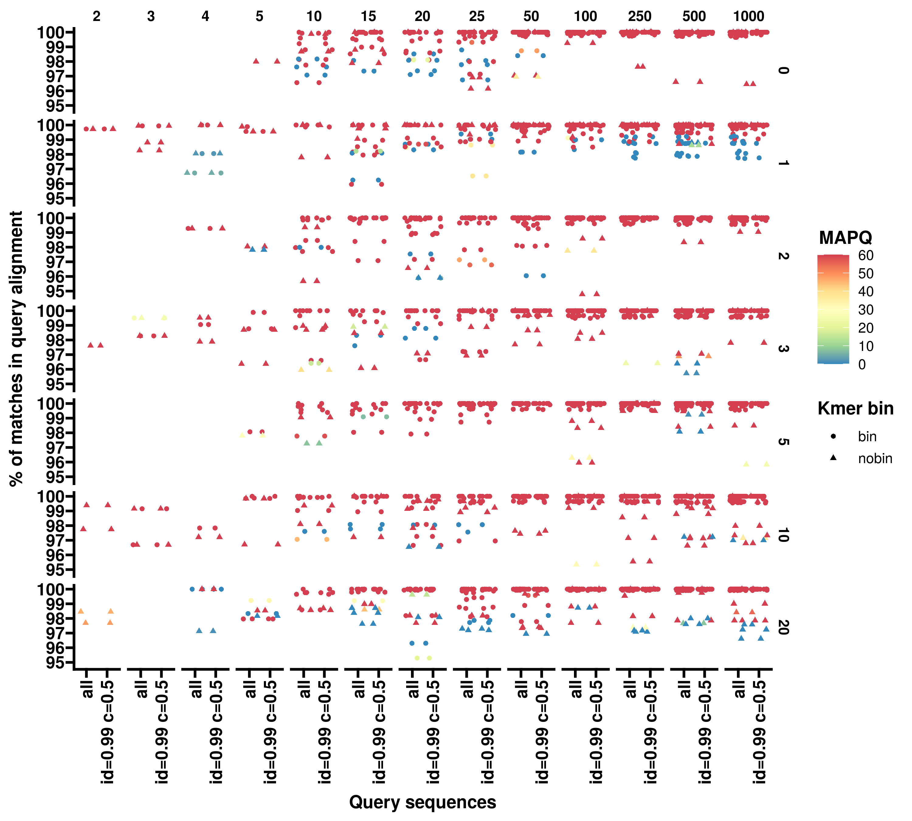
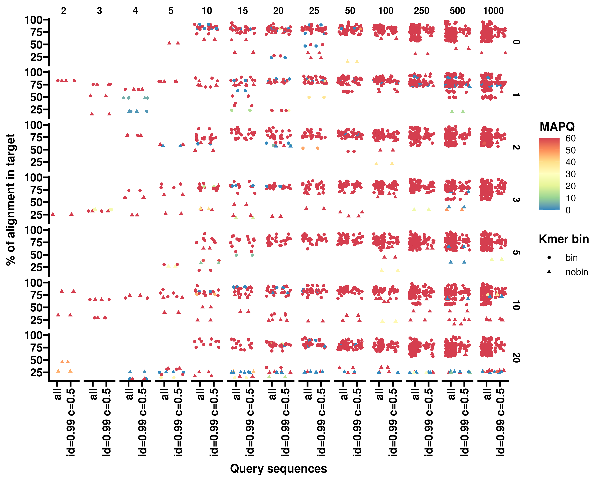
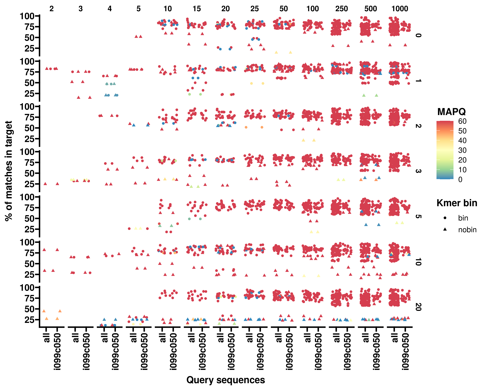
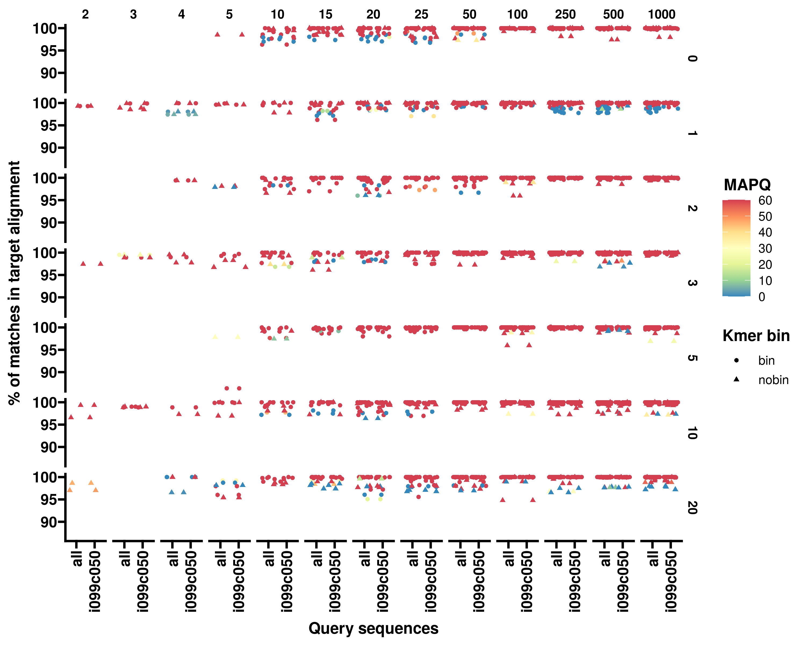

# Kamp

[](https://snakemake.bitbucket.io)
[](https://github.com/yanhui09/Kamp/actions?query=branch%3Amaster+workflow%3ACI)

`Kamp` is a kmer-based denoise workflow to analyze long-read noisy amplicons by Nanopore sequencing, e.g., 16S rRNA gene.
Using `Snakemake` as the job controller, `Kamp` is wrapped into a python package for development and mainteniance.
`Kamp` provides an end-to-end solution from bascecalled reads to the final count matrix.

**Important: `Kamp` is under development, and here released as a preview for early access. 
As `Kamp` integrates multiple bioinformatic tools, it is only tested in Linux systems, i.e., Ubuntu.
The detailed instruction and manuscript are in preparation.**

# Installation
[Conda](https://docs.conda.io/projects/conda/en/latest/user-guide/install/index.html) is the only required dependency prior to installation.
[Miniconda](https://docs.conda.io/en/latest/miniconda.html) is enough for the whole pipeline. 

1. Clone the Github repository and create an isolated `conda` environment
```
git clone https://github.com/yanhui09/Kamp.git
cd Kamp
conda env create -n kamp -f kampenv.yml 
```
You can speed up the whole process if [`mamba`](https://github.com/mamba-org/mamba) is installed.
```
mamba env create -n kamp -f kampenv.yml 
```
2. Install `Kamp` with `pip`
      
To avoid inconsistency, we suggest installing `Kamp` in the above `conda` environment
```
conda activate kamp
pip install --editable .
```

At this moment, `Kamp` uses a compiled but tailored `guppy` for barcode demultiplexing (in our lab).<br>
**Remember to revise the config file in `guppy` if new barcodes are introduced.**

# Example
```
conda activate kamp                                  # activate required environment 
kamp init -f /path/to/fastqs -d /path/to/database    # init config file and check
kamp run all                                         # start analysis
```

# Usage

```
Usage: kamp [OPTIONS] COMMAND [ARGS]...

  Kamp: a k-mer based denoise pipeline to process long read amplicon
  sequencing by Nanopore. To follow updates and report issues, see:
  https://github.com/yanhui09/Kamp.

Options:
  -v, --version  Show the version and exit.
  -h, --help     Show this message and exit.

Commands:
  init  Prepare the config file.
  run   Run Kamp workflow.
```

`Kamp` is easy to use. You can start a new analysis in two steps using `kamp init` and `kamp run` . 

Remember to activate the conda environment.
```
conda activate kamp
```

1. Intialize a config file with `kamp init`

`kamp init` will generate a config file in the working directory, which contains the necessary parameters to run `Kamp`.

```
Usage: kamp init [OPTIONS]

  Prepare the config file for Kamp.

Options:
  -f, --fqdir PATH                Path to the basecalled fastq files.
                                  [required]
  -d, --dbdir PATH                Path to the taxonomy databases.  [required]
  -w, --workdir PATH              Output directory for Kamp.  [default: .]
  --fqs-min INTEGER               Minimum number of reads for the
                                  demultiplexed fastqs.  [default: 1000]
  --no-pool                       Do not pool the reads for denoising.
  --subsample                     Subsample the reads.
  --no-trim                       Do not trim the primers.
  --kmerbin                       Conduct kmer binning.
  --cluster [kmerCon|clustCon|isONclustCon|isONcorCon|umiCon]
                                  Methods to generate consensus.  [default:
                                  isONclustCon]
  --chimerf                       Filter possible chimeras by vsearch.
  --jobs-min INTEGER              Number of jobs for common tasks.  [default:
                                  2]
  --jobs-max INTEGER              Number of jobs for threads-dependent tasks.
                                  [default: 6]
  -h, --help                      Show this message and exit.
```

2. Start analysis with `kamp run`

`kamp run` will trigger the full workflow or a specfic module under defined resource accordingly.
Get a dry-run overview with `-n`. `Snakemake` arguments can be appened to `kamp run` as well.

```
Usage: kamp run [OPTIONS] {demultiplex|qc|kmerBin|kmerCon|clustCon|isONclustCo
                n|isONcorCon|umiCon|quant|taxa|tree|requant|all|initDB|nanosim
                } [SNAKE_ARGS]...

  Run Kamp workflow.

Options:
  -w, --workdir PATH  Output directory for Kamp.  [default: .]
  -j, --jobs INTEGER  Maximum jobs to run in parallel.  [default: 6]
  -m, --maxmem FLOAT  Maximum memory to use in GB.  [default: 50]
  -n, --dryrun        Dry run.
  -h, --help          Show this message and exit.
```

# Benchmark

We *in silico* benchmarked `Kamp` performance with simulated Nanopore reads at the sequencing depth 
of `1X`, `2X`, `3X`, `4X`, `5X`, `10X`, `15X`, `20X`, `25X`, `50X`, `100X`, `250X`, `500X` and `1000X`. The reads 
were simulated by `Nanosim` on 16S rRNA gene sequences at the minimum divergence of `0`, `1%`, `2%`, 
`3%`, `5%`, `10%` and `20%`. For the simulation reference, `20` sequences were sampled from the representative 
sequences picked from `SILVA_138.1_SSURef_NR99` by `MMseqs2 easy-cluster` at the minimum sequence identity
 of `1`, `0.99`, `0.98`, `0.97`, `0.95`, `0.9` and `0.8`, respectively. 

*To reproduce*
```
conda activate kamp
# with kmer bin 
kamp init -f /path/to/fastqs -d /path/to/database --fqs-min 0 --kmerbin --no-pool --no-trim --cluster isONclustCon
kamp run nanosim
kamp run all
# without kmer bin
rm config.yaml
kamp init -f /path/to/fastqs -d /path/to/database --fqs-min 0 --no-pool --no-trim --cluster isONclustCon
kamp run all
```

The generated denoised sequences were aligned to respective reference with `Minimap2` in base-level mode 
of `asm5`, `asm10` and `asm20`. For comparison, all denoised fragments were dereplicated by `MMseqs2` under
minimum sequence identity of `0.99` and the least coverage of `0.5`. 

1. The number of denoised sequences
   
2. The number of recovered reference
   
3. The percentage of denoised sequence aligned to the reference
   
4. The alignment statistics of benchmarks on reference divergence > 1% `asm5`
   
5. The percentage of alignment block in query/denoised sequence `asm5`
   
6. The percentage of matches in query/denoised sequence `asm5`
   
7. The percentage of matches in alignment block of query/denoised sequence `asm5`
   
8. The percentage of alignment block in target/reference sequence `asm5`
   
9. The percentage of matches in target/reference sequence `asm5`
   
10. The percentage of matches in alignment block of target/reference sequence `asm5`
    

# Acknowledgement

`Kamp` integrates multiple open-source tools to analyze Nanopore amplicon data reproducibly. 
Under preview stage, here listed the software/tools involved in the `Kamp`. The full list will 
be finalized in the manuscript. 

Inspirations from package structure:
[metagenome-atlas](https://github.com/metagenome-atlas/atlas)
[virsorter2](https://github.com/jiarong/VirSorter2)

Included Software (Not all in direct use):
[Seqkit](https://github.com/shenwei356/seqkit)
[Taxonki](https://github.com/shenwei356/taxonkit)
[Cutadapt](https://github.com/marcelm/cutadapt)
[Spoa](https://github.com/rvaser/spoa)
[Racon](https://github.com/isovic/racon)
[Medaka](https://github.com/nanoporetech/medaka)
[UMAP](https://github.com/lmcinnes/umap)
[HDBSCAN](https://github.com/scikit-learn-contrib/hdbscan)
[isONclust](https://github.com/ksahlin/isONclust)
[isONcorrect](https://github.com/ksahlin/isONcorrect)
[NanoCLUST](https://github.com/genomicsITER/NanoCLUST)
[DTR-phage-pipeline](https://github.com/nanoporetech/DTR-phage-pipeline)
[Kraken2](https://github.com/DerrickWood/kraken2)
[MMseqs2](https://github.com/soedinglab/MMseqs2)
[Nanosim](https://github.com/soedinglab/MMseqs2)
[QIIME2](https://qiime2.org/)
[Longread_umi](https://github.com/SorenKarst/longread_umi)
[Vsearch](https://github.com/torognes/vsearch)
[Minimap2](https://github.com/lh3/minimap2)
[Samtools](https://github.com/samtools/samtools)
[Blast](https://blast.ncbi.nlm.nih.gov/Blast.cgi?PAGE_TYPE=BlastDocs)
[Rsync](https://github.com/WayneD/rsync)
